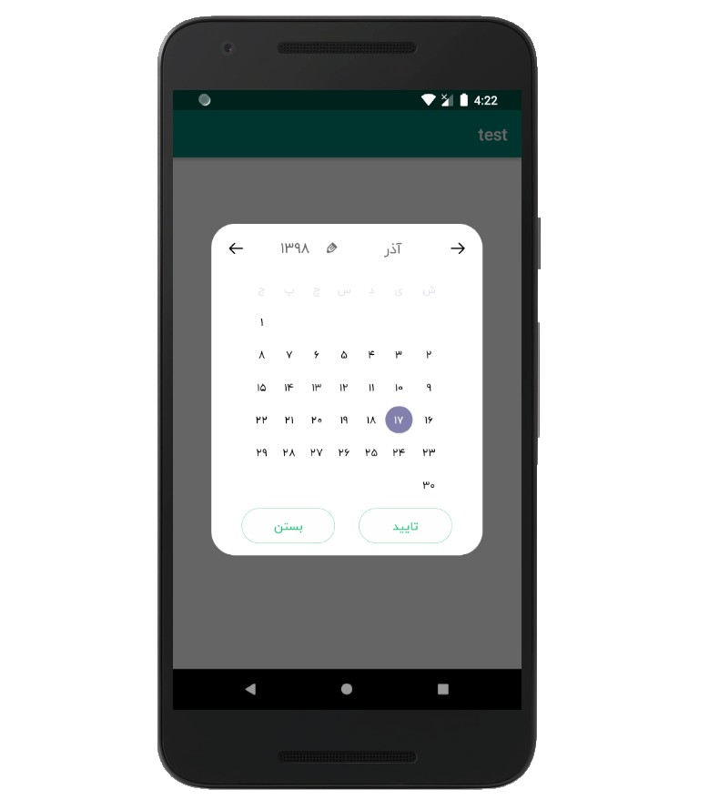

# AwesomePersianCalendar

Android Persian Jalali customizable calendar .




### Requirements
* Android SDK 19+

### Usage

Add the dependency:

```
dependencies {
  implementation 'ymz.yma.awesomepersiancalendar:awesomepersiancalendar:1.0.2'
}
```
### How to use this library in your project?

use PersianCalendar.Builder to configure and build calendar , then call show() method from builder to showUp ;)

```java
CalendarBuilder picker = PersianCalendar.Builder(this, new DatePickedListener() {
            @Override
            public void onDatePicked(int Year, int Month, int Day) {
                Log.d("MAIN",Year +"/"+Month+"/"+Day);      // define Listener on picking new date
            }
        })
                .setYearRange(1300, 1380)         // define range of year
                .setDefDay(22)                    // define default day manually ( by default is today! ) 
                .setDefMonth(1)                   // define default month manually ( by default is this month! ) 
                .setDefYear(1372)                   // define default year manually ( by default is this year! ) 
                .setDayPickedColor(Color.parseColor("#BCAAA4"))     // define day picked color 
                .setCancelable(false)                               // define cancelable ( by default is false )
                .setCloseBackgroundColor(Color.parseColor("#DCE775"))   // define close button background color
                .setConfBackgroundColor(Color.parseColor("#DCE775"))    // define confirm button background color
                .setActionButtons("بستن", "تایید")         // define close and confirm button text ( set NULL to make theme invisible)
                .setConfStrokeColor(Color.parseColor("#673AB7"))    // define confrim button stroke color
                .setConfTextColor(Color.parseColor("#2196F3"))     // define cancel button stroke color
                .Build();

        picker.show();    // show calendar dialog 
        picker.dismiss();   //  dismiss calendar dialog
        
```
